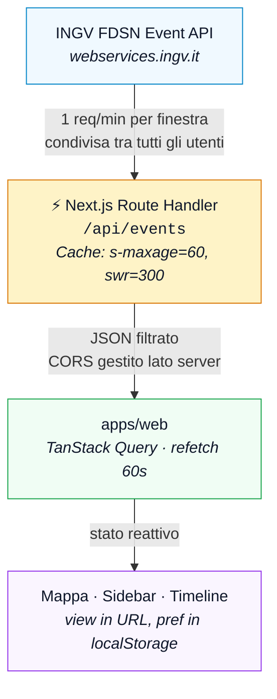

# QuakeWatch IT

<picture><source media="(prefers-color-scheme: dark)" srcset="https://www.shieldcn.dev/github/ci/lpdsgn/quakewatch-it.svg?variant=secondary&amp;size=sm&amp;mode=dark"></picture>
<picture><source media="(prefers-color-scheme: dark)" srcset="https://www.shieldcn.dev/github/license/lpdsgn/quakewatch-it.svg?variant=ghost&amp;size=sm&amp;mode=dark"></picture>
<picture><source media="(prefers-color-scheme: dark)" srcset="https://www.shieldcn.dev/badge/Stack-TypeScript-3178C6.svg?logo=typescript&amp;variant=branded&amp;size=sm&amp;mode=dark"></picture>
<picture><source media="(prefers-color-scheme: dark)" srcset="https://www.shieldcn.dev/badge/ESM-only-16a34a.svg?variant=secondary&amp;size=sm&amp;mode=dark"></picture>
<picture><source media="(prefers-color-scheme: dark)" srcset="https://www.shieldcn.dev/badge/Agent--friendly-AGENTS.md-D97757.svg?variant=secondary&amp;size=sm&amp;mode=dark"></picture>

**Monitoraggio sismico in Italia basato sui Web Services FDSN dell'INGV.**

Webapp informativa per il monitoraggio sismico in Italia, basata sui [Web Services FDSN](https://terremoti.ingv.it/webservices_and_software) pubblici dell'[Istituto Nazionale di Geofisica e Vulcanologia](https://www.ingv.it/) (INGV — Osservatorio Nazionale Terremoti). Progetto personale senza scopo di lucro.

> **Questa app non è un sistema di allerta o early warning.** I dati sono preliminari e soggetti a revisione.

## Come funziona

QuakeWatch IT è una webapp che mostra gli eventi sismici recenti in Italia su una mappa interattiva. I dati provengono esclusivamente dall'API pubblica INGV (`webservices.ingv.it`), senza database o backend propri. L'API supporta CORS aperto e cache con `max-age=60`: il polling si allinea a questa finestra per evitare richieste ridondanti. Lo storico delle revisioni (magnitudo e localizzazione) è già fornito dall'API stessa, quindi non è necessario archiviare dati localmente.

L'app si presenta come una mappa navigabile con timeline temporale e pannello per esplorare i dettagli di ogni evento. Il view state (finestra temporale, area geografica, evento selezionato) è nell'URL, quindi ogni vista è condivisibile e deep-linkabile. Le preferenze utente (tema, filtri, tipo di mappa) sono salvate in localStorage.

## Funzionalità principali

- **Mappa interattiva** dell'Italia con epicentri colorati per magnitudo (giallo→rosso, convenzione INGV) e opacità proporzionale all'età
- **Sidebar informativa**: riepilogo numerico (seven-segment), preset aree (Italia, Campi Flegrei, Etna), lista eventi, dettaglio con storico revisioni
- **Timeline istogramma** con scrubber: densità eventi nel tempo, cursore interattivo, modalità LIVE con polling a 60s
- **Layer ShakeMap**: contorni di intensità MMI per eventi processati (M>=3), con attribuzione INGV
- **"Percepiti"** filtra gli eventi stimando l'intensità MMI da magnitudo e profondità, mostrando solo eventi ≥ III della scala Mercalli.
- **Temi dark e light**, dark default, toggle manuale, init da `prefers-color-scheme`
- **Pagina evento SEO** (`/evento/[eventId]`): server-rendered, condivisibile, indicizzabile
- **Stato UI**: view (finestra, area, evento) in URL → deep-linkabile; preferenze (variante, basemap) in localStorage
- **Resilienza**: cache client (TanStack Query), cache proxy (CDN), off-line detection, retry con backoff

## Tecnologie

| Area              | Scelta                                                                                                                       |
| ----------------- | ---------------------------------------------------------------------------------------------------------------------------- |
| **Framework**     | [Next.js](https://nextjs.org/) 16 — App Router, React Server Components, Turbopack                                           |
| **Mappa**         | [MapLibre GL](https://maplibre.org/) v5 + [react-map-gl](https://visgl.github.io/react-map-gl/) v8 + tile Protomaps gratuiti |
| **Stile**         | [Tailwind CSS](https://tailwindcss.com/) v4 + [shadcn/ui](https://ui.shadcn.com/)                                            |
| **Data fetching** | [TanStack Query](https://tanstack.com/query) v5 — polling, cache, dedup richieste                                            |
| **Animazioni**    | [anime.js](https://animejs.com/) v4                                                                                          |
| **Validazione**   | [Zod](https://zod.dev/)                                                                                                      |
| **Proxy API**     | Route Handler Next.js → FDSN INGV, cache CDN condivisa                                                                       |
| **Parsing**       | `fast-xml-parser` per QuakeML, parsing custom per formato text INGV                                                          |
| **Tooling**       | pnpm monorepo, TypeScript strict, oxlint/oxfmt, lefthook, vitest                                                             |

## Architettura e fonte dati

I dati sismici provengono dall'API **FDSN Event** dell'INGV:



- **Endpoint**: `https://webservices.ingv.it/fdsnws/event/1/query`
- **Formati**: QuakeML e text (pipe-separated)
- **CORS**: `Access-Control-Allow-Origin: *`
- **Cache**: `max-age=60`

Il proxy server-side (Next.js Route Handler) inoltra tutte le richieste verso l'API INGV senza mai esporre direttamente l'endpoint FDSN al browser, applicando cache semantica HTTP standard.

Nessun database: l'API INGV fornisce già lo storico revisioni (`includeallorigins=true&includeallmagnitudes=true`). I dati di scuotimento (ShakeMap) sono file statici pubblici su `shakemap.ingv.it`.

Maggiori informazioni sul modello dati sono disponibili nel [repository ufficiale INGV](https://github.com/INGV/openapi).

L'implementazione delle mappe di squotimento prende ispirazione dal [repository INGV ShakeMap Web Portal](https://github.com/INGV/shakemap4-web).

Sono disponibili anche i servizi INGV per stazioni sismiche (FDSN Station) e dati di scuotimento (ShakeData), valutati per integrazioni future.

## Filtro percezione

Il toggle `Percepiti | Tutti` filtra la lista eventi in base alla loro percepibilità stimata. La classificazione usa un modello sismologico standard che, partendo da magnitudo e profondità, stima l'intensità al suolo (Modified Mercalli Intensity, MMI) tramite l'equazione IPE di Atkinson & Wald (2007):

$$MMI = 3.23 + 1.18 M - 2.44 \log_{10}(R)$$

dove $R = \max(\text{profondità}, 1)$. La soglia è MMI ≥ III (scala Mercalli), ovvero il confine tra "avvertito" e "solo rilevato strumentalmente".

- **Percepiti (default):** mostra solo gli eventi che superano la soglia
- **Tutti:** mostra tutti gli eventi; quelli sotto soglia appaiono in trasparenza

Il calcolo è lato client, senza chiamate API aggiuntive: magnitudo e profondità sono già nei dati di ogni evento. La preferenza è salvata localmente.

## Struttura

```
quakewatch-it/
├── apps/web/          # App Next.js — mappa, UI, Route Handler proxy
├── packages/
│   ├── core/          # Client FDSN, parsing (text + QuakeML), dedup, tipi, hook TanStack Query
│   └── tokens/        # Palette, scale, mapping semantico, CSS, buildMapStyle()
└── docs/              # Documentazione API INGV, spec design, piani futuri
```

## Roadmap

- **Fase 1 (attuale)**: webapp Next.js su Vercel con mappa, timeline, esplorazione eventi

Il backlog completo delle feature post-v1 è tracciato in [`docs/future-plan.md`](docs/future-plan.md).

## Licenza

Il codice di questo progetto è rilasciato sotto licenza Apache 2.0 — vedi [LICENSE](LICENSE).

I dati sismici provengono dall'[INGV — Osservatorio Nazionale Terremoti](https://terremoti.ingv.it/) e sono distribuiti sotto [CC-BY 4.0](https://creativecommons.org/licenses/by/4.0/). I dati ShakeMap provengono da [shakemap.ingv.it](https://shakemap.ingv.it/).

## Riferimenti

- [Specifica OpenAPI INGV](https://github.com/INGV/openapi)
- [MCP server INGV](https://github.com/INGV/mcp-fdsnws-event)
- [ShakeMap Web Portal](https://github.com/INGV/shakemap4-web)
- [API INGV e strategia di polling](docs/api-web-services.md)
- [Risorse esterne INGV e MCP server](docs/risorse-esterne.md)